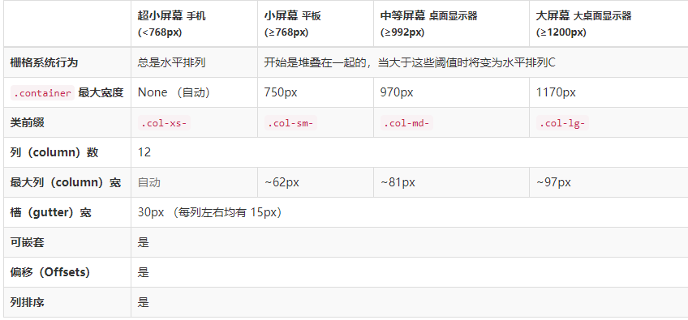

# bootstrap

## bootstrap


## 起步

Bootstrap使用Html5文档类型，并设置移动设备优先

### 使用HTML5文档类型

```html
<!DOCTYPE html>
<html lang="zh-CN>
  ...
</html>
```
### 屏幕自适应
设置屏幕自适应，默认以移动设备优先
```
<head>
  <meta name="viewport" content="width=device-width, initial-scale=1">
</head>
```

若想在不同屏幕设备上保持原生应用，通过滚动屏幕来显示

可添加user-scalable=no 可以禁用其缩放（zooming）功能。

`<meta name="viewport" content="width=device-width, initial-scale=1, maximum-scale=1, user-scalable=no">`

### 全局样式

Bootstrap 排版、链接样式设置了基本的全局样式。分别是：

1. 为 body 元素设置 background-color: #fff;
2. 使用 @font-family-base、@font-size-base 和 @line-height-base 变量作为排版的基本参数
3. 为所有链接设置了基本颜色 @link-color ，并且当链接处于 :hover 状态时才添加下划线

这些样式都能在 scaffolding.less 文件中找到对应的源码。


### 布局容器

Bootstrap 需要为**页面内容和栅格系统**包裹一个 .container 容器。

我们提供了两个作此用处的类。注意，由于 padding 等属性的原因，这两种 容器类不能互相嵌套。

.container 类用于固定宽度并支持响应式布局的容器。
```
<div class="container">
  ...
</div>

.container-fluid 类用于 100% 宽度，占据全部视口（viewport）的容器。
<div class="container-fluid">
  ...
</div>
```

## 栅格系统

Bootstrap 提供了一套响应式、移动设备优先的流式栅格系统，

随着屏幕或视口（viewport）尺寸的增加，系统会自动分为最多12列。

它包含了易于使用的预定义类，还有强大的mixin 用于生成更具语义的布局。

### 栅格描述

下面简单介绍下：
1. “行（row）”必须包含在 .container （固定宽度）或 .container-fluid （100% 宽度）中，以便为其赋予合适的排列（aligment）和内补（padding）
2. 通过“行（row）”在水平方向创建一组“列（column）”，只有“列（column）”可以作为行（row）”的直接子元素，内容应当放置于“列（column）”内
3. 栅格系统中的列是通过指定1到12的值来表示其跨越的范围。例如，三个等宽的列可以使用三个 .col-xs-4 来创建
4. 类似 .row 和 .col-xs-4 这种预定义的类，可以用来快速创建栅格布局
4. 栅格类针对不同屏幕大小设备，设置分界点，自动使用适用于与屏幕宽度大于或等于分界点大小的设备。

|设备|描述|分界点|代码|
|-|-|-|-|
|手机|超小屏幕|小于768px|.col-xs-|
|平板|小屏幕|大于等于 768px|.col-sm-|
|桌面显示器|中屏幕|大于等于 992px|.col-md-|
|大桌面显示器|大屏幕|大于等于 1200px|.col-lg-|


### 栅格分界点

```less
/* 超小屏幕（手机，小于 768px） */
/* 没有任何媒体查询相关的代码，因为这在 Bootstrap 中是默认的（还记得 Bootstrap 是移动设备优先的吗？） */

/* 小屏幕（平板，大于等于 768px） */
@media (min-width: @screen-sm-min) { ... }

/* 中等屏幕（桌面显示器，大于等于 992px） */
@media (min-width: @screen-md-min) { ... }

/* 大屏幕（大桌面显示器，大于等于 1200px） */
@media (min-width: @screen-lg-min) { ... }
```

通过下表可以详细查看 Bootstrap 的栅格系统是如何在多种屏幕设备上工作的



### 实例演示

将要在使用shan

#### 实例：从堆叠到水平排列

```html
<div class="row">
  <div class="col-md-8">.col-md-8</div>
  <div class="col-md-4">.col-md-4</div>
</div>
<div class="row">
  <div class="col-md-6">.col-md-8</div>
  <div class="col-md-6">.col-md-8</div>
</div>

```

这里使用单一的.col-md-* 栅格类来创建一个基本的栅格系统，当在手机和平板设备上显示时是堆叠在一起的（分界点在超小屏幕到小屏幕这一范围内）

在桌面（中等）屏幕设备上变为水平排列。

#### 实例：移动设备和桌面屏幕

假如不希望在小屏幕设备上所有列都堆叠在一起？那就需要增加对超小屏幕设备定义类，即.col-xs-*

```HTML
<div class="row">
  <div class="col-xs-12 col-md-8">.col-xs-12 .col-md-8</div>
  <div class="col-xs-6 col-md-4">.col-xs-6 .col-md-4</div>
</div>
<!-- 当用手机展示时，超过12列，则其他6列会自动另起一行；当用桌面显示时正好一行12列显示 -->


<!-- Columns are always 50% wide, on mobile and desktop -->
<div class="row">
  <div class="col-xs-6 col-md-6">.col-xs-6 .col-md-6</div>
  <div class="col-xs-6 col-md-6">.col-xs-6 .col-md-6</div>
</div>
```
<!-- 不同用手机还是桌面显示正好一行12列 -->

#### 实例：手机、平板、桌面

```HTML
<div class="row">
  <div class="col-xs-12 col-sm-6 col-md-8">.col-xs-12 .col-sm-6 .col-md-8</div>
  <div class="col-xs-6 col-md-4">.col-xs-6 .col-md-4</div>
</div>
```

####  响应式列重置

### 列偏移

### 嵌套列

### 列排序

通过使用 .col-md-push-* 和 .col-md-pull-* 类就可以很容易的改变列（column）的顺序。

```html
<div class="row">
  <div class="col-md-9 col-md-push-3">.col-md-9 .col-md-push-3</div>
  <div class="col-md-3 col-md-pull-9">.col-md-3 .col-md-pull-9</div>
</div>
```
