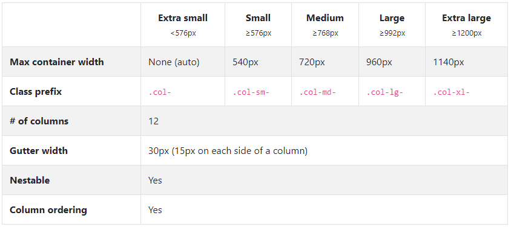

# 布局 -layout

    概述
      容器 - Containers
      响应断点 - Responsive breakpoints
      第三个轴 - z-index
    网格系统
      列排序
      嵌套列
      列偏移
      实例演示
      网格描述
    灵活的媒体对象
    响应式实用程序类


## 概述

Bootstrap通过包装容器，强大的网格系统，灵活的媒体对象和响应式实用程序类来布局。

### 容器 - Containers

容器是Bootstrap最基本的布局元素，如果要使用网格系统，容器一定要被使用

1. 固定宽度容器
.container 为每个分界点的屏幕设置最大固定宽度的容器。

```html
<div class="container">
  ...
</div>

2. 流式容器
.container-fluid 使用（viewport）的100% 宽度，占据全部视口宽度的容器。
<div class="container-fluid">
  ...
</div>
```

### 响应断点 - Responsive breakpoints

断点基于最小视窗宽度(viewport),允许在视窗发生变化时更改更大的视窗宽度。

bootstrap使用媒体查询(media query)为我们的布局和界面创建合理的断点。

Bootstrap主要在布局，网格系统和组件的源Sass文件中使用以下媒体查询范围或断点

```html
// Extra small devices (portrait phones, less than 576px)
// No media query since this is the default in Bootstrap

// Small devices (landscape phones, 576px and up)
@media (min-width: 576px) { ... }

// Medium devices (tablets, 768px and up)
@media (min-width: 768px) { ... }

// Large devices (desktops, 992px and up)
@media (min-width: 992px) { ... }

// Extra large devices (large desktops, 1200px and up)
@media (min-width: 1200px) { ... }
```

设备与屏幕关系

|设备|描述|分界点|代码|
|-|-|-|-|
|手机超小屏幕|Extra small devices|小于 576px|.col-xs-|
|手机小屏幕|Small devices|大于等于 576px|.col-sm-|
|平板|Medium devices|大于等于 768px|.col-md-|
|大显示器|Large devices|大于等于 992px|.col-lg-|
|超大显示器|Extra large devices|大于等于 1200px|.col-xg-|

通过下表可以详细查看 Bootstrap 的栅格系统是如何在多种屏幕设备上工作的



### 第三个轴 - z-index
Bootstrap组件使用z-index，CSS属性通过提供第三个轴来排列内容来帮助控制布局

该标度旨在正确地分层导航，工具提示，弹出窗口，导航栏，下拉菜单和模态等等

```sass
$zindex-dropdown:          1000 !default;
$zindex-sticky:            1020 !default;
$zindex-fixed:             1030 !default;
$zindex-modal-backdrop:    1040 !default;
$zindex-modal:             1050 !default;
$zindex-popover:           1060 !default;
$zindex-tooltip:           1070 !default;
```


## 网格系统

Bootstrap 提供了一套响应式、移动设备优先的流式栅格系统，

随着屏幕或视口（viewport）尺寸的增加，系统会自动分为最多12列。

它包含了易于使用的预定义类，还有强大的mixin 用于生成更具语义的布局。

### 网格描述

下面简单介绍下：
1. “行（row）”必须包含在 .container （固定宽度）或 .container-fluid （100% 宽度）中，以便为其赋予合适的排列（aligment）和内补（padding）
2. 通过“行（row）”在水平方向创建一组“列（column）”，只有“列（column）”可以作为行（row）”的直接子元素，内容应当放置于“列（column）”内
3. 栅格系统中的列是通过指定1到12的值来表示其跨越的范围。例如，三个等宽的列可以使用三个 .col-xs-4 来创建
4. 类似 .row 和 .col-xs-4 这种预定义的类，可以用来快速创建栅格布局
4. 栅格类针对不同屏幕大小设备，设置分界点，自动使用适用于与屏幕宽度大于或等于分界点大小的设备。

|设备|描述|分界点|代码|
|-|-|-|-|
|手机|超小屏幕|小于768px|.col-xs-|
|平板|小屏幕|大于等于 768px|.col-sm-|
|桌面显示器|中屏幕|大于等于 992px|.col-md-|
|大桌面显示器|大屏幕|大于等于 1200px|.col-lg-|


### 实例演示

#### 实例：从堆叠到水平排列

```html
<div class="row">
  <div class="col-md-8">.col-md-8</div>
  <div class="col-md-4">.col-md-4</div>
</div>
<div class="row">
  <div class="col-md-6">.col-md-8</div>
  <div class="col-md-6">.col-md-8</div>
</div>

```

这里使用单一的.col-md-* 栅格类来创建一个基本的栅格系统，当在手机和平板设备上显示时是堆叠在一起的（分界点在超小屏幕到小屏幕这一范围内）

在桌面（中等）屏幕设备上变为水平排列。

#### 实例：移动设备和桌面屏幕

假如不希望在小屏幕设备上所有列都堆叠在一起？那就需要增加对超小屏幕设备定义类，即.col-xs-*

```HTML
<div class="row">
  <div class="col-xs-12 col-md-8">.col-xs-12 .col-md-8</div>
  <div class="col-xs-6 col-md-4">.col-xs-6 .col-md-4</div>
</div>
<!-- 当用手机展示时，超过12列，则其他6列会自动另起一行；当用桌面显示时正好一行12列显示 -->


<!-- Columns are always 50% wide, on mobile and desktop -->
<div class="row">
  <div class="col-xs-6 col-md-6">.col-xs-6 .col-md-6</div>
  <div class="col-xs-6 col-md-6">.col-xs-6 .col-md-6</div>
</div>
```
<!-- 不同用手机还是桌面显示正好一行12列 -->

#### 实例：手机、平板、桌面

```HTML
<div class="row">
  <div class="col-xs-12 col-sm-6 col-md-8">.col-xs-12 .col-sm-6 .col-md-8</div>
  <div class="col-xs-6 col-md-4">.col-xs-6 .col-md-4</div>
</div>
```

####  响应式列重置

### 列偏移

### 嵌套列

### 列排序

通过使用 .col-md-push-* 和 .col-md-pull-* 类就可以很容易的改变列（column）的顺序。

```html
<div class="row">
  <div class="col-md-9 col-md-push-3">.col-md-9 .col-md-push-3</div>
  <div class="col-md-3 col-md-pull-9">.col-md-3 .col-md-pull-9</div>
</div>
```

## 灵活的媒体对象

媒体对象有助于构建复杂且重复的组件，通过.media和.media-body两个类来

```

```
